# Welcome employers, environmental data enthusiasts!

### Contact:
 - **E-mail:** [jahbrunton@gmail.com](jahbrunton@gmail.com)
 - **Phone:** Inquire/Please Refer to Application

### Portfolio Guide:
For simplicity, this document does serve as a working version of the my project portfolio, but my [Portfolio website](https://jbrunto.github.io/Jonathan_Brunton_Portfolio/) contains the same info, and a clean .pdf version can also be found within the [Supporting Materials](./Supporting_Materials/). 
In addition to this portfolio, my additional public repositories include:
  - A sandbox environment for the development and deployment of CMAQ's Public Documentation: [CMAQ_Docs_v55](https://github.com/jbrunto/CMAQ_Docs_v55), with a working [web version](https://jbrunto.github.io/CMAQ_Docs_v55/) hosted within the Github Actions.
  - A dead version of my Master's [Capstone Project](https://github.com/jbrunto/Seismic_Machine_Learning), 'Developing Screening Tools to Assess CO2 Storage', which is described in short [Below](#Thesis).

*Additional Directories*
- images/ : images to be displayed
- docs/ : host space for my website's HTML documentation, yet another version of this portfolio

#### Sections
  - [I. Atmospheric Data Scientist](#Employment)
  - [II. Background](#Background)
  - [III. Master's Thesis Project](#Thesis)
  - [IV. Major Environmental Data Projects](#Projects)
  - [V. Interdisciplinary Skills](#Skills)
  - [VI. Professional and Personal References](#References)

## I. Atmospheric Data Scientist

**Oak Ridge Associated Universities NSSC**

**U.S. Environmental Protection Agency, ORD-CEMM-AESMD**

*October 2023-Pres. - Research Triangle Park, NC*

### Primary Duties
 - Perform model evaluation for the EPA’s Community Multiscale Air Quality (CMAQ) scientific development team by investigating the impact of gridded inputs on CMAQ Ozone outputs with historical data. Analyze and package results visually and in writing to project leadership to deliver to State and Local organizations attempting to reach ozone attainment.
    - “Evaluating the impact of modeled meteorology and ozone bias using Random Forest Regression”
	- Lead-developer of a Python-based workflow that provides a spatiotemporal analysis of the relationship between trends in modeled (NCAR’s Weather Research & Forecasting Model; WRF) meteorology and modeled (EPA’s Air Quality Time Series; EQUATES) ozone bias.
	- Perform big data wrangling, preprocessing of twenty model years of data in a High-Performance Computing environment; leveraged EPA’s Atmospheric Model Evaluation Tool (AMET) for WRF data acquisition, QA/QC of scientifically relevant data.
	- Trained and optimized a Random Forest model suite to perform feature permutation for quantifying the relative importance of meteorological and non-meteorological potential drivers of CMAQ MDA8 Ozone Bias.
	- Relay results to internal CMAQ development teams, agency groups with CMAQ model interests, and spoke at [CMAS Conference 2024](https://cmascenter.org/conference/2024/agenda.cfm). 
             - Design investigation within the scope of physical regions in model domain, as well as the administrative regions that govern air quality and emissions.

### Additional Duties
- Develop public-facing notebook tutorials for analyzing cloud-based CMAQ/EQUATES data hosted on AWS Open Data Registry by reading and compressing the S3 bucket data (>1 TB) into local and SageMaker Jupyter servers.
- Contributor to CMAQ’s Github through documentation upkeep and Github Actions workflows.
- Lead developer of multi-language (Python, HTML, Markdown Flavor) workflow for building and deploying CMAQ’s Github Pages hosted [documentation website](https://jbrunto.github.io/CMAQ_Docs_v55/).
- Active member of internal Center for Environmental Measurement and Modeling’s Data Science development community; led demonstrations and discussion of Pythonic data science and machine learning techniques and software configuration. 
- Developed an internal tool for directly querying and reading CMAQ’s SQL held data into a Python environment as interactive datasets.
- Consult generally on adjacent projects exploiting geospatial data with Python/SQL software and machine-learning techniques.

## II. Background

### Current Employment
October 2023-Present

**Atmospheric Data Scientist**

Model Evaluation/Outreach with the Community Multiscale Air Quality Model (CMAQ) Model Development Team

Environmental Protection Agency & Oak Ridge Associated Universities (National Student Serviced Contract)

Speaker at CMAS Conference 2024 - *['Evaluating The Relationship of Modeled Meteorology and Ozone Bias using Random Forest Regression'](https://cmascenter.org/conference/2024/agenda.cfm)*

### Education
October 2021-November 2022

**MSc Environmental Data Science & Machine Learning**

Imperial College London / London, England

*Notable Awards:* Merit Graduate

**Course Details:** [MSc EDSML](https://www.imperial.ac.uk/study/courses/postgraduate-taught/environmental-data-science-machine-learning/)

*Extracurricular Activities:* Imperial College Union, Player/Coach for American Football Club

August 2017-May 2021

**BS Planetary Sciences**

Purdue University / West Lafayette, IN

*Notable Awards:* Presidential Scholarship, Paul & Linda Krishna Scholarship in Earth, Atmospheric, and Planetary Sciences, 6x Dean's List Placement, 6x Semester's Honors

**Course Details:** [BS Planetary Sciences](https://www.eaps.purdue.edu/for_students/undergraduate/planetary/index.html)

*Extracurricular Activities:* Undergraduate Teaching Assistant (EAPS 102: Earth Science for Elementary Teachers), College of Science Ambassador, Gimlet Leadership Honorary (Secretary), Planetary Science Society of Purdue, Purdue Astronomy Club, Wesley Foundation Service

## III. Thesis Project

*Motivation:* Traditional workflows for assessing a subsurface region's ability to store fluid require ample manual interpretation and destructive collection processes in addition to advanced seismic modeling. With next-generation velocity data recovered from Full-Waveform Inversion techniques of a subsurface region, we aim to automate the entirety of this workflow for fault systems specifically by:
- Extracting meaningful data features for a large, raw seismic reflectivity volume by leveraging advanced numerical methods
- Developing an unsupervised image clustering model to predict the locations of faults within the volume
- Combining and using the predicted volume with velocity data to create a 3D visualization tool and assess predicted fault's ability to store fluid.

### ML Model Development - K-Means Clustering
Initial steps were taken to clean and transform raw seimic reflectivity image data into a numerically derived coherency volume using 3D interpretation. 2D, 'stackable' images of these transformations were sent to be trained on a K-Means clustering model, which was developed to highlight large, 3D discontinuities within the volume. Only data with viable intra-cluster intertia values were selected for the final predicted fault locations. This process is shown below, left-to-right.

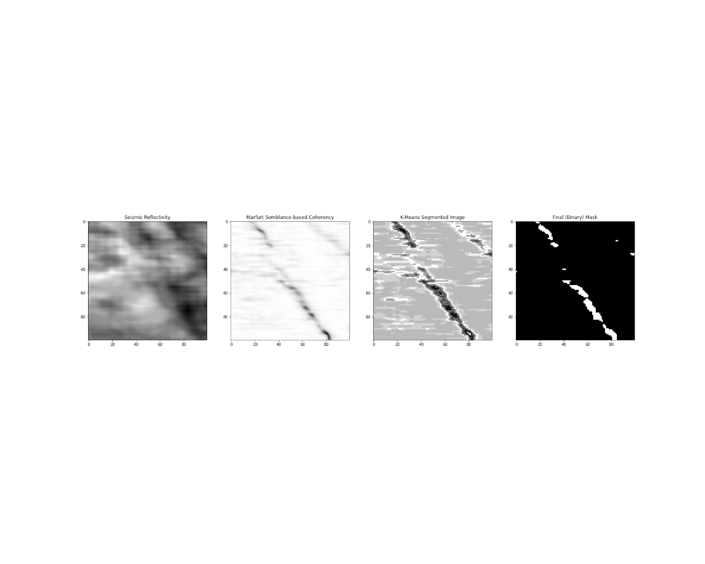

The clustering model was optimized using a numerical interpretation of the 'Elbow Method', with both average sum of squared distances (SSD) and explained variance as evaluation metrics. Shown below is the numerical interpretation that found the optimal number of image clusters for segmentation in this study, with SSD as an evaluator. Additionally, another elbow graph, with SSD as an evaluator, shows that the fitted trends of the training and testing sets is nearly identical, validating the results of the model from model bias or overfitting.

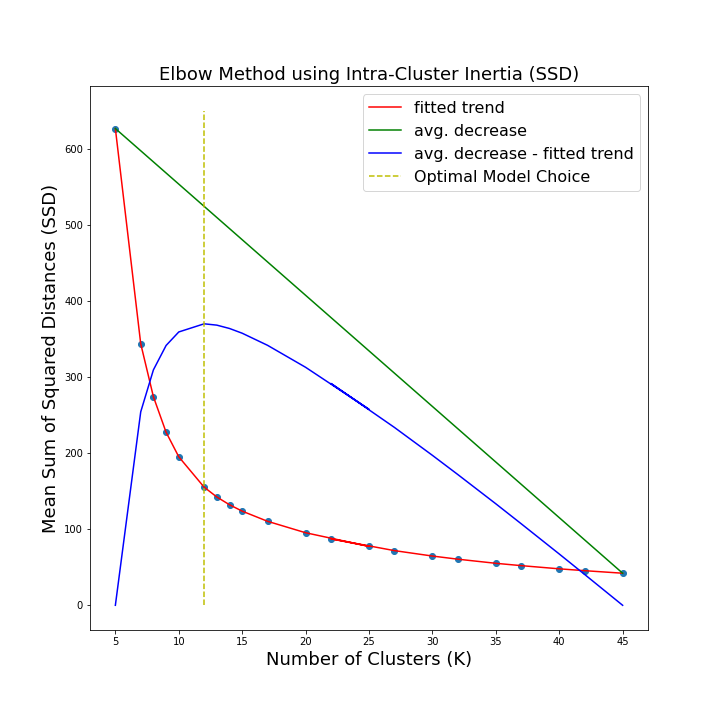
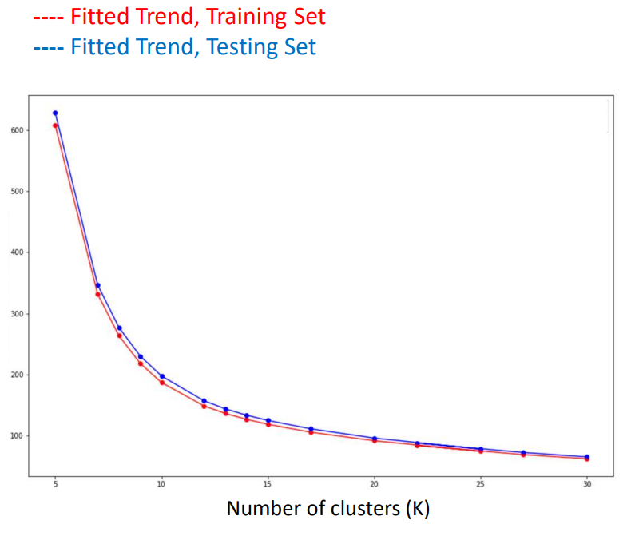

### Screening Tool (Proposed Workflow)
As briefly aforementioned, this is a novel approach in combining the information from a predicted fault volume with FWI velocity data into a single, interpretable volume. This provides an initial assessment to whether an extracted fault system can store fluid, by highlighting low- or high-velocity anomalies within the image of the system. The relative velocities of some predicted fault locations are shown in the colored image below, while the coherency volume it was derived from is shown in greyscale.

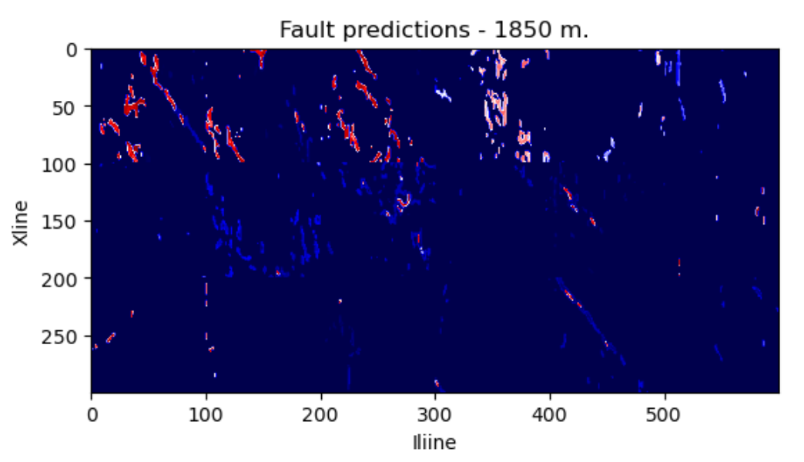
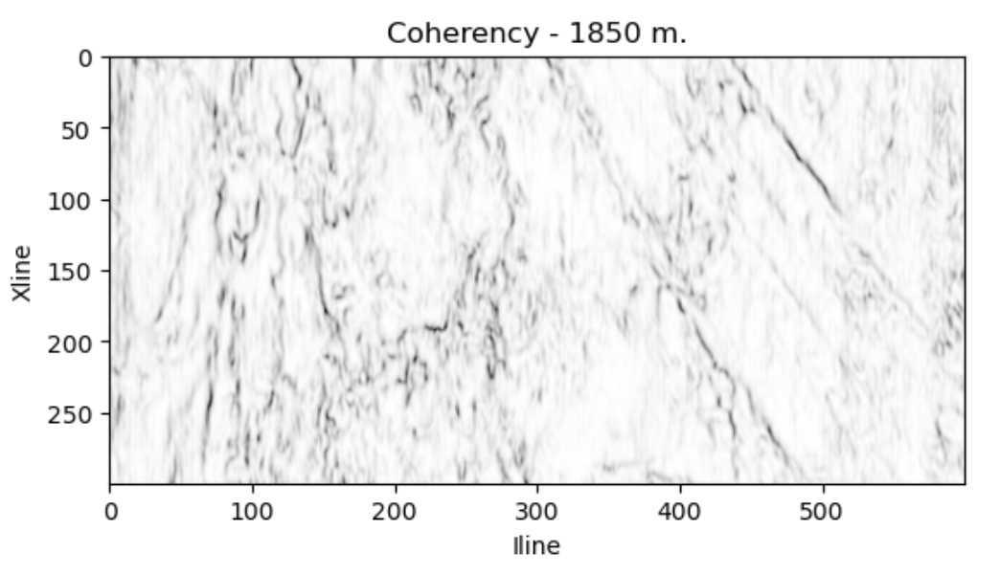

A major advantage of using a binary mask for predicted fault locations is uncovering the relative velocities from both within and outside of the faults, shown below on left. In addition to the data preprocessing, model training, and prediction workflow contained inside a jupyter notebook, a 3D visualization of the volume's predicted faults/velocities was developed for completing the automation of the manual interpretation of these seismic volumes.

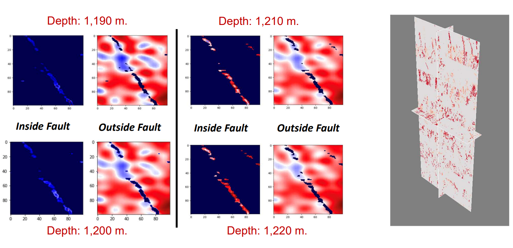

*A brief note on results*

If afforded more time, there would have been a few avenues to strengthen the power of this screening tool, including:
- An investigation into what other seismic features (numerical interpretations of the raw reflectivity volume) may reveal in their ability to better distinguish faults from the surrounding region and other 3D seismic discontinuities.
- Developing a supervised image segmentation model using labeled faults.
- Optimizing model performance with updated programming methods and migrating model training to high-performance computing environment.
- Developing an ecosystem to host a web-version of the 3D, interactive screening tool with better visualization libraries.

**[Github Repo (DEAD) - Capstone Project](https://github.com/jbrunto/Seismic_Machine_Learning)**

## IV. Major Master's Projects
A series of sprint-esque, multi-week projects in which 4-7 inter-academic course graduate co-developers develop machine learning applications of environmental datasets, culminating in the 'product release' and presentation to hypothetical clients and interest groups.

### Hurricane Forecasting with Computer Vision
*Motivation:* Given a set of satellite images of a hurricane, predict the hurricane's evolution.

*Proposed Solution:* A convolution LSTM and GAN-LSTM were separately trained and tested, both constructed in PyTorch. The former achieved better results in both image prediction (according to a customly developed evaluation metric specific to image pixel similarity) and computational cost. Some results are shown below

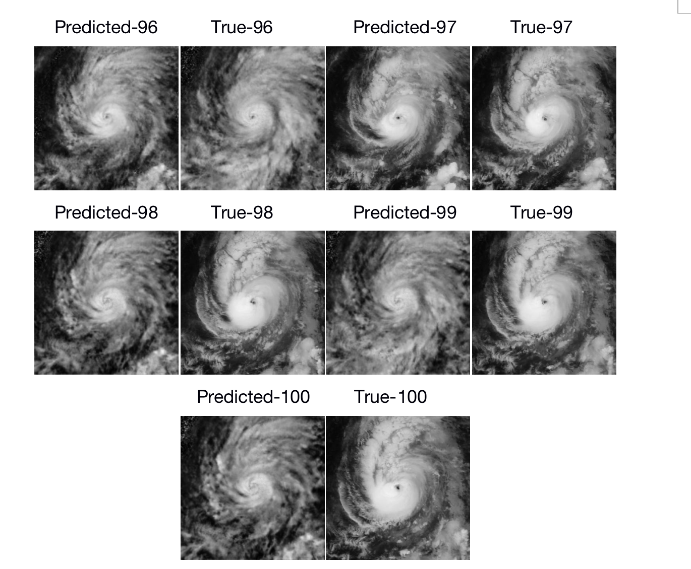

*Project Roles:* Lead developer of image preprocessing workflow, co-developer of convolutional LSTM workflow (architecture optimzation), documentation and code sustainability maintainer, lead presenter.

### Wildfire Forecasting and Correction
*Motivation:* Using time series of satellite imagery coupled with ground sensor data, develop a neural network to predict the evolution of the wildfire in simulated 'real-time'.

*Proposed Solution:* Principal Components Analysis (PCA) addressed issues of compressing and coupling the data, while an ensemble convolutional autoencoder-random forest regressor predicted wildfire image evolution in physical space. A Kalman filter was developed for the latent space of the autoencoder, correcting predictions in real-time. The images below show a comparison of the wildfire sensor ground truths and model predictions.

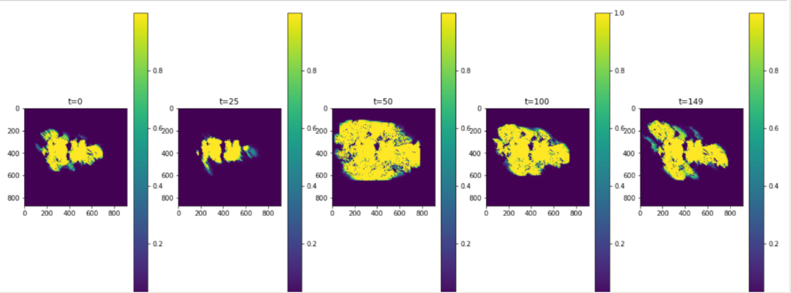
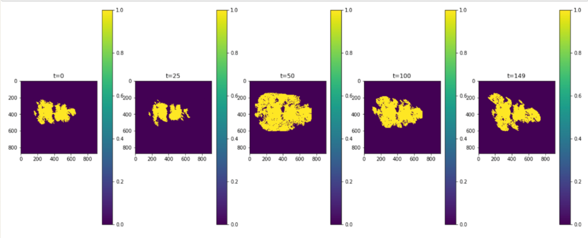

*Project Roles:* Lead PCA developer, co-developer of data assimilation workflow (filter tuning), Python project suite testing, lead presenter

### Flood evolution and cost-of-damage prediction
*Motivation:* Given historical flood data, local rainwater data, and property value estimates, classify the flood probability and predict cost of damages for every postcode in England.

*Proposed Solution:* Given the limited amount of data, leverage scientific principles to create new data features from the existing set. The cleaned, manipulated, and integrated dataset is sent to a multi-class model for flood probability. Each of the ten classes outputted by the model is the last input needed for a K-Nearest Neighbors regressor that predicts the corresponding damage cost. Screenshots of results from the classification model are shown in color, with damage cost in greyscale.

**Ground Truths**
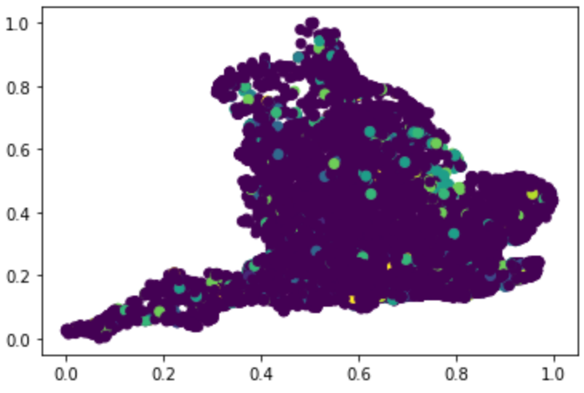
**Final Predictions**
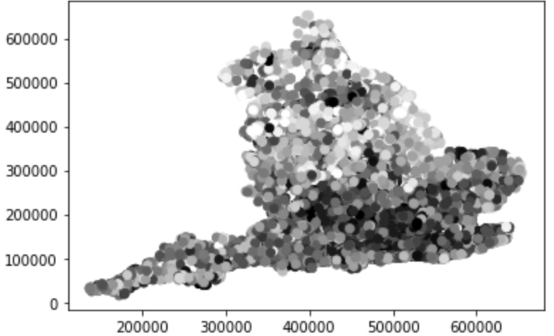

*Project Roles:* Lead developer of KNN regressor, lead data preprocessing developer, dataset feature creation, documentation and code sustainability maintainer, lead presenter

## V. Skills in Data and Geoscience

### Programming Languages
- Python:
  - **Expert** Numerical processing and applications, data visualization libraries
     - Numpy, Pandas, Scipy, Matplotlib (Pyplot), Plotly, Seaborn
  - **Fluent** Sci-Kit Learn; basic-to-intermediate machine learning applications
  - **Advanced** Deep-learning libraries
     - Pytorch, Keras (Tensorflow), OpenCV
  - **Advanced** Sphinx, Sphinx-Design; for automated HTML deployment of repository code and text (markdown, restructured-text) documentation
  - **Advanced** PyTest, for automated and customized code testing
  - **Experienced** Specialized libraries for the environmental data manipulation
     - Geopandas, Xarray, NetCDF4, Segyio, GDAL, Shapely, Rasterio
- **Familiar** Trained academically, practiced in research/employment occasionally
  - R (RStudio), C++
- **Experienced/Practicing**
  - SQL, primarily through Python's interfacing library mySQL

### Programming Environments
- Github (**Experienced**):
  - git, Github CLI
  - Github Actions for basic continuous integration practices and automated documentation creation
  - Github Pages for hosting documentation websites directly from repository
  - Contributor to the [Community Multiscale Air Quality (CMAQ) model repository](https://github.com/USEPA/CMAQ), familiar with integration and repository maintaining best-practices.
- Jupyter Lab preferred for Python and general software development, familiar with VisualStudio
- Proficient with command-line programming and shell scripting, and ensuring sustainability across operating systems
  - MacOS, Windows, Linux; Bash, C-Shell
- Comfortable in virtual and High-Performance Computing environments
  - Most experienced in private, familiar with AWS ecosystem

### Remote Sensing/Environmental Data
- General Software/Geographic Information Systems (GIS) Experience
  - ERMapper, Petrel, ArcGIS, IDL, ENVI, MASTER, CRISM, Google Earth Engine
- Comfortable in exploiting satellite imagery and various environmental sensor datasets (RADAR, LIDAR, Spectral) for identification of soil, water, greenery, etc. image data.
- Advanced Model Output Experience
  - EPA's Community Multiscale Air Quality (CMAQ) Model, NCAR's Weather Research & Forecasting (WRF) Model for air quality and meteorology evaluation, respectively.
- Advanced Dataset Knowledge
  - NetCDFs (.nc), Segy Seismic Volumes (.sgy)

#### General
- Machine Learning
  - Familiar and comfortable with using a variety of machine learning and deep-learning algorithms to develop applications for data within and beyond environmental sciences. Experience with regression/classfication and supervised/unsupervised architectures.
    - Linear, Logistic, Forest, CNNs, Convolutional Autoencoders, GANs, LSTMs, FFNs
- Skilled presentation and instruction of work, scientific principles to large groups (seminars, client groups) and small.
- Interdisplinarian scientific programmer, degreed or employed in each of the fields earth, atmospheric, and planetary sciences.
- 8+ years experience in internet and community-forum browsing for advanced computational and environmental problem solving. 7+ years experience in leveraging Google Scholar to further research.
- Passion for strengthening team interpersonal development and morale
- Basic German language skills and actively learning American Sign Language

Environmental advocate, park enthusiast, aging amateur athlete, hiker, fisher, birder, Durham music-goer, and community servant.

## VI. References
Inquire for references, see [Contact](#Contact)